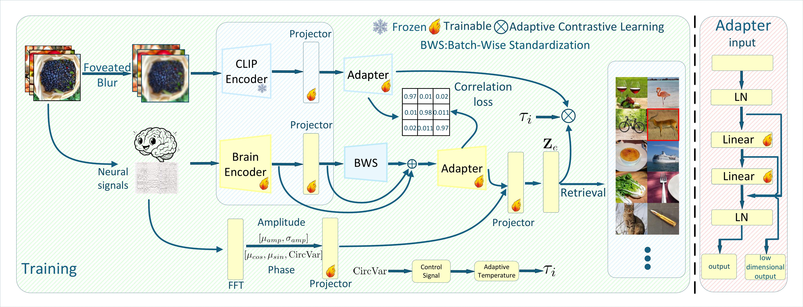

# Stabilizing Neural-to-Image Retrieval with Frequency-Domain Priors and Adaptive Supervision：面向 EEG/MEG 视觉检索的跨模态对齐

本仓库实现了一个面向 **THINGS-EEG** 与 **THINGS-MEG** 的脑信号—图像检索框架。模型以冻结的 CLIP 图像表征为视觉目标，通过注视式模糊先验、脑信号投影、批内标准化、CCA 风格相关性约束、频域幅相调制和可靠度自适应对比学习，将 EEG/MEG 表征对齐到视觉表征空间。

## 模型框架

<p align="center">
  
</p>


## 目录

- [环境配置](#环境配置)
- [项目结构](#项目结构)
- [数据准备与下载](#数据准备与下载)
- [数据目录结构](#数据目录结构)
- [运行训练](#运行训练)
  - [THINGS-EEG](#things-eeg)
  - [THINGS-MEG](#things-meg)
- [实验输出](#实验输出)
- [模型流程](#模型流程)
- [致谢](#致谢)

## 环境配置

推荐使用 Linux/CUDA 环境：Python 3.8.19、CUDA 12.0、PyTorch 2.4.1。

```bash
conda create -n grbe python=3.8.19 -y
conda activate grbe
pip install -r requirements.txt
```

`requirements.txt` 仅列出源码的直接运行依赖；其中已包含 OpenCLIP、PyTorch Lightning、OpenCV 和用于可选文本分支的 Transformers。

## 项目结构

```text
GRBE/
├── README.md
├── requirements.txt
├── main_barlow_text_zca_qr_img_eegprj_cca_attn_dis_t.py  # 主训练与评估入口
├── train_zca_qr_img_eegprj.sh                            # THINGS-EEG 启动脚本
├── train_meg_zca_qr_img_eegprj.sh                        # THINGS-MEG 启动脚本
├── base/
│   ├── data_eeg.py                                       # THINGS-EEG 数据加载
│   ├── data_meg.py                                       # THINGS-MEG 数据加载
│   ├── data_meg_txt.py                                   # 可选文本/BLIP 数据分支
│   ├── eeg_backbone.py                                   # 脑信号编码器
│   ├── inpating_data.py                                  # 注视式模糊处理
│   └── utils.py                                          # 配置、损失与工具函数
├── configs/
│   ├── eeg/ubp_zca_qr_img_eegprj.yaml                    # EEG 实验配置
│   └── meg/ubp_zca_qr_img_eegprj.yaml                    # MEG 实验配置
├── data/                                                  # 数据集（不提交到 Git）
├── exp/                                                   # TensorBoard、检查点与测试结果
└── logs/                                                  # Bash 脚本的终端日志
```

## 数据准备与下载

为方便复现，推荐直接下载 UBP 作者公开的已处理数据；下载后按下文的目录结构放置即可，无需重新处理原始脑信号。

- 处理后的 [THINGS-EEG（Hugging Face）](https://huggingface.co/datasets/Haitao999/things-eeg)
- 处理后的 [THINGS-MEG（Hugging Face）](https://huggingface.co/datasets/Haitao999/things-meg)
- 可选的 [UBP 预训练权重](https://huggingface.co/Haitao999/ubp_exp)

如需从原始数据开始处理，请从以下官方来源下载：

- [THINGS 图像库（OSF）](https://osf.io/jum2f/)
- [THINGS-EEG（OSF）](https://osf.io/anp5v/files/osfstorage)
- [THINGS-MEG（OpenNeuro ds004212）](https://openneuro.org/datasets/ds004212)

原始数据较大，且部分图像文件受原始数据集使用条款约束；请遵守各数据集的许可、访问条件及引用要求。`data/`、特征缓存、`exp/` 和 `logs/` 不应提交到 GitHub。

## 数据目录结构

下列结构与当前 YAML 配置和数据加载代码一致。`train.pt` 与 `test.pt` 是模型实际读取的预处理文件；`Image_feature/FoveaBlur/` 会在首次提取冻结 CLIP 图像特征时自动生成。

```text
data/
├── things-eeg/
│   ├── Image_set/                         # 原始 THINGS 图像（可选保留）
│   ├── Image_set_Resize/                  # 224 × 224 图像，运行时读取
│   ├── Raw_data/                          # 原始 EEG（可选）
│   ├── Preprocessed_data_250Hz_whiten/
│   │   ├── sub-01/
│   │   │   ├── train.pt
│   │   │   └── test.pt
│   │   ├── ...
│   │   └── sub-10/
│   └── Image_feature/
│       └── FoveaBlur/                     # 自动生成的 CLIP 图像特征缓存
└── things-meg/
    └── things-meg/                        # 对应 configs/meg 中的 data_dir
        ├── Image_set/                     # 原始 THINGS 图像（可选保留）
        ├── Image_set_Resize/              # 224 × 224 图像，运行时读取
        ├── ds004212-download/             # 原始 THINGS-MEG（可选）
        ├── Preprocessed_data/
        │   ├── sub-01/
        │   │   ├── train.pt
        │   │   └── test.pt
        │   ├── ...
        │   └── sub-04/
        └── Image_feature/
            └── FoveaBlur/                 # 自动生成的 CLIP 图像特征缓存
```

> **MEG 路径说明：** 当前配置的 `data_dir` 为 `data/things-meg/things-meg/Preprocessed_data`。若将 Hugging Face 数据直接下载到 `data/things-meg/`，请将其内容再置于内层 `things-meg/` 目录，或相应修改 `configs/meg/ubp_zca_qr_img_eegprj.yaml` 中的 `data_dir`。

## 运行训练

所有 Bash 命令默认使用 GPU 0、随机种子 0，并为每位受试者分别训练。使用 `--sub 01` 可只运行一个受试者；`--all` 则运行该数据集的所有受试者。

### THINGS-EEG

**Intra-subject**：每位受试者在自身数据上训练与测试。

```bash
bash train_zca_qr_img_eegprj.sh --all --exp intra-subject --cuda 0
```

**Inter-subject**：留一受试者测试；脚本会依次将每位受试者作为测试对象，其余受试者构成训练集。

```bash
bash train_zca_qr_img_eegprj.sh --all --exp inter-subject --cuda 0
```

例如，仅运行 `sub-08`：

```bash
bash train_zca_qr_img_eegprj.sh --sub 08 --exp intra-subject --cuda 0
```

### THINGS-MEG

**Intra-subject**：每位 MEG 受试者独立训练和测试。

```bash
bash train_meg_zca_qr_img_eegprj.sh --all --exp intra-subject --cuda 0
```

**Inter-subject**：留一受试者测试；其余 MEG 受试者用于训练。

```bash
bash train_meg_zca_qr_img_eegprj.sh --all --exp inter-subject --cuda 0
```

例如，仅运行 `sub-01`：

```bash
bash train_meg_zca_qr_img_eegprj.sh --sub 01 --exp intra-subject --cuda 0
```

常用可选参数：

```bash
# 多随机种子、指定脑编码器与视觉编码器
bash train_meg_zca_qr_img_eegprj.sh \
  --sub 01 --seeds 0,1,2 --cuda 0 \
  --brain BaseModel --vision RN50 \
  --epoch 40 --lr 5e-5
```

## 实验输出

每次运行会生成两类输出：

```text
logs/
└── sub-01_seed0_BaseModel_RN50.log         # Bash 脚本保存的标准输出与错误日志

exp/
└── {dataset}_{exp_setting}_ubp_{brain_backbone}_{vision_backbone}/
    └── sub-01_seed0_{MMDD_HHMMSS}/
        ├── events.out.tfevents.*           # TensorBoard 日志
        ├── checkpoints/
        │   ├── last.ckpt
        │   └── epoch=*-step=*-val_top1_acc=*.ckpt
        └── test_results.json                # 最终 Top-1、Top-5、mAP 等指标
```

查看训练曲线：

```bash
tensorboard --logdir exp
```


## 致谢

本项目的数据组织、实验框架参考并感谢 [Uncertainty-aware Blur Prior (UBP)](https://github.com/HaitaoWuTJU/Uncertainty-aware-Blur-Prior) 项目及其论文：

> Wu, H., Li, Q., Zhang, C., He, Z., & Ying, X. (2025). *Bridging the Vision-Brain Gap with an Uncertainty-Aware Blur Prior*. CVPR 2025.

同时感谢 THINGS、THINGS-EEG 和 THINGS-MEG 数据集作者提供公开、高质量的数据资源。使用本项目时，请同时引用 UBP 与对应数据集的原始论文。
